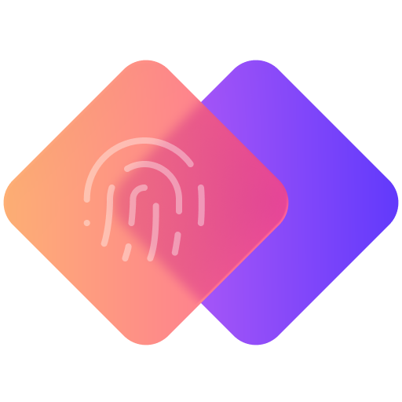

<p align="center">
  
</p>

# Coppy

Coppy is a secure personal vault for storing IDs, cards, policies, account details, and other private records in one place.

## The Problem It Solves

Important personal information is often kept in physical documents, scattered notes, screenshots, or chat messages. That creates friction when you need something quickly.

Coppy solves this by giving you a single place to store and quickly retrieve personal data when needed, removing the hassle of searching through hard copy documents just to find one detail.

## What The App Does

- Stores personal records such as IDs, cards, policies, and other sensitive entries
- Organizes entries into folders or groups
- Lets users search and retrieve information quickly
- Supports hidden items for added privacy
- Allows fast copy and share actions when information is needed
- Adds biometric protection for sensitive actions

## Architecture

This project uses `MVVM` as its application architecture.

The general flow is:

- `View`: Compose UI screens and components
- `ViewModel`: state handling, UI logic, and user actions
- `Model`: local data layer, repositories, use cases, and persistence

The codebase also uses dependency injection and feature-based organization to keep presentation, domain, and data concerns separated.

## Technology Used

### Core Stack

- `Kotlin Multiplatform` for shared Android and iOS code
- `Compose Multiplatform` for UI
- `Android Application + iOS App` targets
- `Gradle Kotlin DSL` for build configuration

### Architecture And App Structure

- `MVVM` for presentation structure
- `Koin` for dependency injection
- Feature-based modular organization inside the shared app code

### Data And Storage

- `SQLDelight` for local database access
- `SQLCipher` on Android for encrypted local database support
- `Multiplatform Settings` for lightweight app preferences and flags

### Platform Features

- `AndroidX Navigation Compose` for navigation
- `AndroidX Biometric` for biometric authentication on Android
- Compose resource system for shared assets

## Project Structure

- [`composeApp/src`](./composeApp/src) contains the shared Kotlin Multiplatform application code
- [`composeApp/src/commonMain/kotlin`](./composeApp/src/commonMain/kotlin) contains shared business logic and UI
- [`composeApp/src/androidMain`](./composeApp/src/androidMain) contains Android-specific implementations
- [`composeApp/src/iosMain`](./composeApp/src/iosMain) contains iOS-specific implementations
- [`iosApp`](./iosApp) contains the iOS app entry point and Xcode project

## Current App Version

- `Application ID`: `org.noztek.coppy`
- `Version Name`: `v0.1.0-alpha`
- `Version Code`: `1`

## How To Run The App

### Android

Build the debug app:

```sh
./gradlew :composeApp:assembleDebug
```

Run it from Android Studio using the Android run configuration, or install the generated debug build on an Android device or emulator.

### iOS

Open the Xcode project in [`iosApp`](./iosApp) and run the app from Xcode on a simulator or connected iPhone.

### Optional Verification

To verify the Android shared code compiles:

```sh
./gradlew :composeApp:compileDebugKotlinAndroid
```
