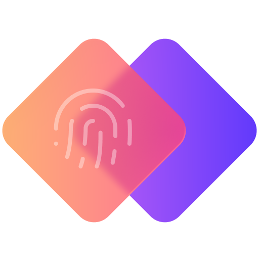

<p align="center">
  
</p>

# Coppy

Coppy is a secure personal vault for storing IDs, cards, policies, account details, and other private records in one place.

Important personal information is often kept in physical documents, scattered notes, screenshots, or chat messages. That creates friction when you need something quickly.

Coppy solves this by giving you a single place to store and quickly retrieve personal data when needed, removing the hassle of searching through hard copy documents just to find one detail.

## What The App Does

- Stores personal records such as IDs, cards, policies, and other sensitive entries
- Organizes entries into folders or groups
- Lets users search and retrieve information quickly
- Supports hidden items for added privacy
- Allows fast copy and share actions when information is needed
- Adds biometric protection for sensitive actions

## Architecture

This project uses `MVVM` as its application architecture.

The general flow is:

- `View`: Compose UI screens and components
- `ViewModel`: state handling, UI logic, and user actions
- `Model`: local data layer, repositories, use cases, and persistence

The codebase also uses dependency injection and feature-based organization to keep presentation, domain, and data concerns separated.

## Technology Used

### Core Stack

- `Kotlin Multiplatform` for shared Android and iOS code
- `Compose Multiplatform` for UI
- `Android Application + iOS App` targets
- `Gradle Kotlin DSL` for build configuration

### Architecture And App Structure

- `MVVM` for presentation structure
- `Koin` for dependency injection
- Feature-based modular organization inside the shared app code

### Data And Storage

- `SQLDelight` for local database access
- `SQLCipher` on Android for encrypted local database support
- `Multiplatform Settings` for lightweight app preferences and flags

### Platform Features

- `AndroidX Navigation Compose` for navigation
- `AndroidX Biometric` for biometric authentication on Android
- Compose resource system for shared assets

## Project Structure

- [`composeApp/src`](./composeApp/src) contains the shared Kotlin Multiplatform application code
- [`composeApp/src/commonMain/kotlin`](./composeApp/src/commonMain/kotlin) contains shared business logic and UI
- [`composeApp/src/androidMain`](./composeApp/src/androidMain) contains Android-specific implementations
- [`composeApp/src/iosMain`](./composeApp/src/iosMain) contains iOS-specific implementations
- [`iosApp`](./iosApp) contains the iOS app entry point and Xcode project

## Google Play ASO

### App Name

`Coppy`

### Short Description

Keep personal details, notes, links, and snippets ready for quick access.

### Full Description

Coppy keeps your personal details, notes, links, and snippets in one secure place, so you can access them quickly whenever you need them.

Important information often gets scattered across hard copy documents, notes, screenshots, copied text, and old messages. Coppy solves that by giving you a simple personal vault for the things you want to keep close and easy to use again.

Whether it is personal records, account details, saved links, private notes, or short snippets, Coppy helps you stay organized without unnecessary complexity.

Use Coppy to:

- store personal details in one place
- save notes, links, copied text, and useful snippets
- copy saved content quickly when needed
- organize entries into folders
- hide sensitive items for extra privacy
- protect access and important actions with biometrics

Why Coppy is useful:

- quick access to information you use often
- less time searching through documents and messages
- simple organization for important personal content
- privacy-focused protection for sensitive data
- clean and lightweight experience

Features:

- secure local storage for your personal information
- fast copy and reuse for saved details
- folders for better organization
- hidden items for extra privacy
- biometric protection
- light mode, dark mode, and system theme support

Coppy is built for a simple real-world need: saving important information once and keeping it ready for whenever you need it again.

## Current App Version

- `Application ID`: `org.noztek.coppy`
- `Version Name`: `v0.1.0-alpha`
- `Version Code`: `1`

## How To Run The App

### Android

Build the debug app:

```sh
./gradlew :composeApp:assembleDebug
```

Run it from Android Studio using the Android run configuration, or install the generated debug build on an Android device or emulator.

### iOS

Open the Xcode project in [`iosApp`](./iosApp) and run the app from Xcode on a simulator or connected iPhone.

### Optional Verification

To verify the Android shared code compiles:

```sh
./gradlew :composeApp:compileDebugKotlinAndroid
```
